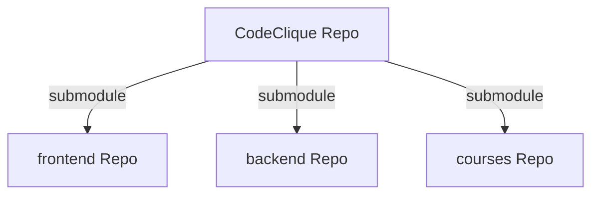

# CodeClique

[](https://github.com/CodeClique-RobertDoisneau/CodeClique/releases)
[](https://github.com/CodeClique-RobertDoisneau/frontend/issues)
[](https://github.com/CodeClique-RobertDoisneau/backend/issues)
[](https://github.com/CodeClique-RobertDoisneau/CodeClique/blob/main/LICENSE)

## 🏗️ Structure du Projet

Ce projet fonctionne avec une architecture modulaire utilisant des **Git Submodules**. Le dépôt principal sert à l'orchestration, tandis que le code source réside dans des dépôts séparés pour le frontend et le backend. Les cours sont dans courses.



- **CodeClique** : Contient la configuration Docker et l'orchestration.
- **frontend** : Le code du frontend, écrit avec Angular.
- **backend** : Le code du backend, écrit avec Django.
- **courses** : Dépôt des cours, écrits en Markdown.

## 🚀 Démarrage

### Développement

1.  **Prérequis** : Docker et Docker Compose.
2.  **Cloner & Initialiser** le dépôt et ses sous-modules :
    ```bash
    git clone --recurse-submodules https://github.com/CodeClique-RobertDoisneau/CodeClique.git
    ```
    *L'option `--recurse-submodules` est cruciale pour télécharger également le code du frontend et du backend.*
3.  **Travailler sur les branches** :
    -   Les sous-modules `frontend` et `backend` fonctionnent indépendamment.
    -   Déplacez-vous dans le dossier concerné et créez votre branche depuis `dev` : `git switch -c feature/ma-feature dev`.
4.  **Lancer l'environnement** :
    ```bash
    docker compose watch
    ```
5.  **Arrêter** : `docker compose down`

### Production

Pour mettre en production, exécutez les commandes suivantes. Voici ce qu'elles font étape par étape :

1.  **Récupération du code complet** :
    ```bash
    git clone --recurse-submodules https://github.com/CodeClique-RobertDoisneau/CodeClique.git
    cd CodeClique
    ```
    Cela clone le dépôt principal et initialise immédiatement les sous-modules frontend et backend.

2.  **Construction des images** :
    ```bash
    docker compose -f compose.yaml -f compose.prod.yaml build --no-cache
    ```
    Combine la configuration de base (`compose.yaml`) avec la surcharge de production (`compose.prod.yaml`) et force une reconstruction complète des images pour garantir que les dernières dépendances sont installées.

3.  **Lancement des conteneurs** :
    ```bash
    docker compose -f compose.yaml -f compose.prod.yaml up -d
    ```
    Lance les services en arrière-plan (`-d`).

## 🤝 Guide de Contribution

Nous utilisons un modèle de branches strict pour garder l'historique propre et lisible.

### Stratégie de Branches

*   **`main`** : Branche de production, stable. Ne jamais commit directement dessus.
*   **`dev`** : Branche d'intégration principale. **Toutes les Pull Requests doivent viser `dev`.**
*   **Branches de travail** : Doivent être tirées depuis `dev` et suivre la convention de nommage.

### Politique de Commit et de Nommage

Nous suivons les spécifications suivantes pour le nommage des commit et des branches:
- **[Conventional Commits](https://www.conventionalcommits.org/)**
- **[Conventional Branches](https://conventional-branch.github.io/)**

### Politique de Merge

1.  **Cible** : Les PRs doivent être fusionnées dans **`dev`**.
2.  **Méthode de Merge** : Dans l'optique d'une meilleure compréhension de l'historique pour des futurs contributeurs, nous préférons faire des **Merge Commit** (sans fast-forward). Les **Squash and Merge** commits sont aussi autorisés mais moins idéaux.
3.  **Validation** : Pas de CI/CD automatique pour le moment. Assurez-vous que votre code compile, que les tests passent localement. Une revue de code est obligatoire avant tout merge.
